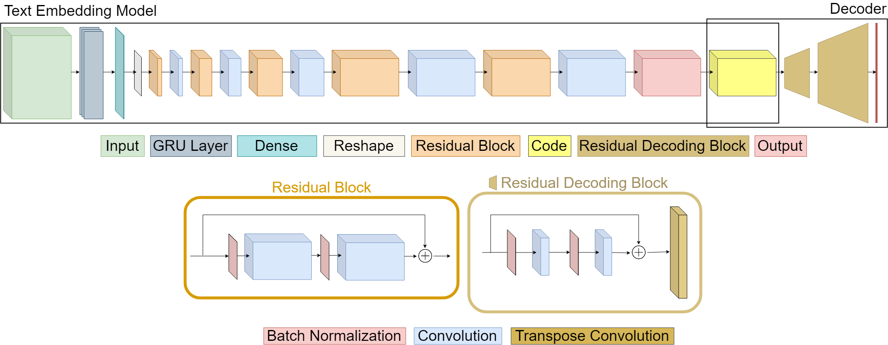
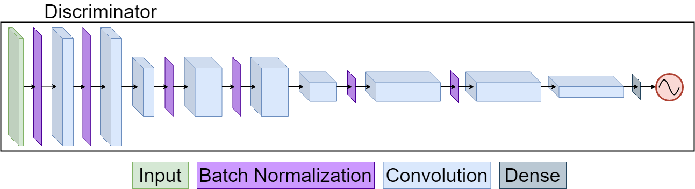

# caption-to-image-synthesis

This repository contains a combined model for general caption to image synthesis using the Common Objects in Context (COCO) dataset. This work explores the performance of several components of the model individually, as well as in tandem. This includes a novel autoencoder with residual blocks, several methods of word embeddings, and briefly touching on adversarial training. This repository continue to be expanded with work on generative adversarial models toward the same goal.

This model is trained in a multi-stage transfer learning fashion.

1. Pre-train FC-autoencdor with skip connection. See this [notebook](autoencoder.ipynb).
2. Detach decoder portion and attach to full generator model. See this [notebook](text-to-image.ipynb).
3. Download and process training data by generating word embeddings. See this [notebook](get-and-clean-data.ipynb) for downloading and cleaning COCO2017. See this [notebook](word2vec.ipynb) for generating word embeddings.
4. Train using the cells in this [notebook](text-to-image.ipynb), this also contains logic to sample and generate new images form arbitrary captions.
## Generator architecture:

## Discriminator architecture:

### Prerequisites

* Python 3.7
* Keras 2.2.4, to be converted to 2.3.0
* COCO training dataset 2017

## Authors

* **Jose Sepulveda** - [joasepul](https://github.com/joasepul)

* **Kevin Woodward** - [kevinwoodward](https://github.com/kevinwoodward)